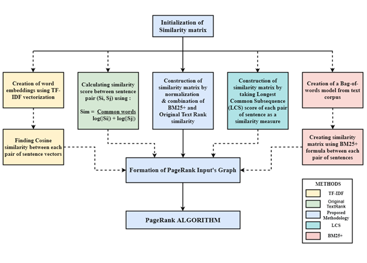

<br />
<div align="center">
  <a href="https://github.com/gulvaibhav20/extractive-text-summarizer">
    
  </a>
  <div align="center">
    <h3> Extractive Article Summarizer</h3>
    <h5> [Using Integrated Text Rank and BM25+ Algorithm] </h5>
  </div>
</div>

<!-- TABLE OF CONTENTS -->
<details>
  <summary>Table of Contents</summary>
  <ol>
    <li>
      <a href="#about-the-project">About The Project</a>
      <ul>
        <li><a href="#built-with">Built With</a></li>
      </ul>
    </li>
    <li>
      <a href="#getting-started">Getting Started</a>
      <ul>
        <li><a href="#prerequisites">Prerequisites</a></li>
      </ul>
    </li>
    <li><a href="#flow-of-the-process">Flow of the Process</a></li>
    <li><a href="#comparison">Comparison</a></li>
    <li><a href="#contact">Contact</a></li>
    <li><a href="#license">LICENSE</a></li>
  </ol>
</details>

## About The Project


<center><strong> Project Screenshot </strong></center> <br />

<div style="text-align: justify">
Textual data is growing exponentially over the internet, it is very tough task to obtain important and relevant information from it. One needs efficient and effective method that provides a concise summary of an article. This can be achieved by the usage of automatic text summarization. <br /> <br />

In this research, the authors proposed an efficient approach for text summarization where an extractive summary has been generated from an article. The methodology has been modified by integrating normalized similarity matrix of both BM25+ and conventional Text Rank algorithm, which resulted in the improvised results. A graph is generated by taking the sentences present in the article as nodes and taking edge weights as the similarity score between two sentences. The nodes with the highest rank are selected and summary is extracted. <br />

Empirical evaluation of the proposed methodology has been analyzed and compared with baseline methods viz. conventional Text Rank algorithm, TF-IDF (Term Frequency–Inverse Document Frequency) Cosine, LCS (Longest Common Consequence), BM25+ by taking precision, recall, F1 score as evaluation criteria. Rouge1, Rouge2, and RougeL scores have been calculated for all the methods. The results show that the proposed method can efficiently summarize any article irrespective of the category it belongs to.

Use the `MAIN.ipynb` to get started.
</div>
<p align="right">(<a href="#top">back to top</a>)</p>

### Built With
This section lists the major frameworks/libraries used in the project :

* [Python](https://www.python.org/)
* [NLTK - Natural Language Toolkit](https://www.nltk.org/)
* [Networkx - Network Analysis in Python](https://networkx.org/)
* [Numpy - Numerical Python](https://numpy.org/)
* [Pandas - Python Data Analysis Library](https://pandas.pydata.org/)

<p align="right">(<a href="#top">back to top</a>)</p>

## Getting Started

Just ***clone*** this repository to get started. Follow the steps to get a local copy up and running :

### Prerequisites

* Jupyter Notebook
* Install Python Packages
  ```
  pip install -r requirements.txt
  ```

## Flow of the Process
<p align="center">
  
</p>
<center><strong> Project Methodology </strong></center> <br />

<div style="text-align: justify">
The project proposes a modified version of the Extractive Graph-based summarization technique also known as TextRank algorithm. It consists of three main phases where the first phase starts by retrieving textual data from the article source, followed by preprocessing of the textual data. Preprocessing includes stopword removal, tokenization, POS tagging, and lemmatization. In the next phase, the similarity between each sentence pair of the article has been calculated then the article is modeled as a graph using the similarity matrix. Finally, in the last phase, a modified TextRank algorithm has been applied and the article summary is generated.
</div>

<p align="right">(<a href="#top">back to top</a>)</p>

## Comparison

<p align="center">
  
</p>
<center><strong> Comparison with Other Algorithms </strong></center> <br />

<div style="text-align: justify">
The above figure depicts the deviations in the process of construction of the similarity matrix in the extractive text summarization process.
</div>

<p align="right">(<a href="#top">back to top</a>)</p>

## Contact

Vaibhav Gulati - gulvaibhav20@gmail.com

Project Link: [https://github.com/gulvaibhav20/extractive-text-summarizer](https://github.com/gulvaibhav20/extractive-text-summarizer)

<p align="right">(<a href="#top">back to top</a>)</p>

## License

Distributed under the [MIT](https://choosealicense.com/licenses/mit/) License. See `LICENSE.txt` for more information.

<p align="right">(<a href="#top">back to top</a>)</p>
