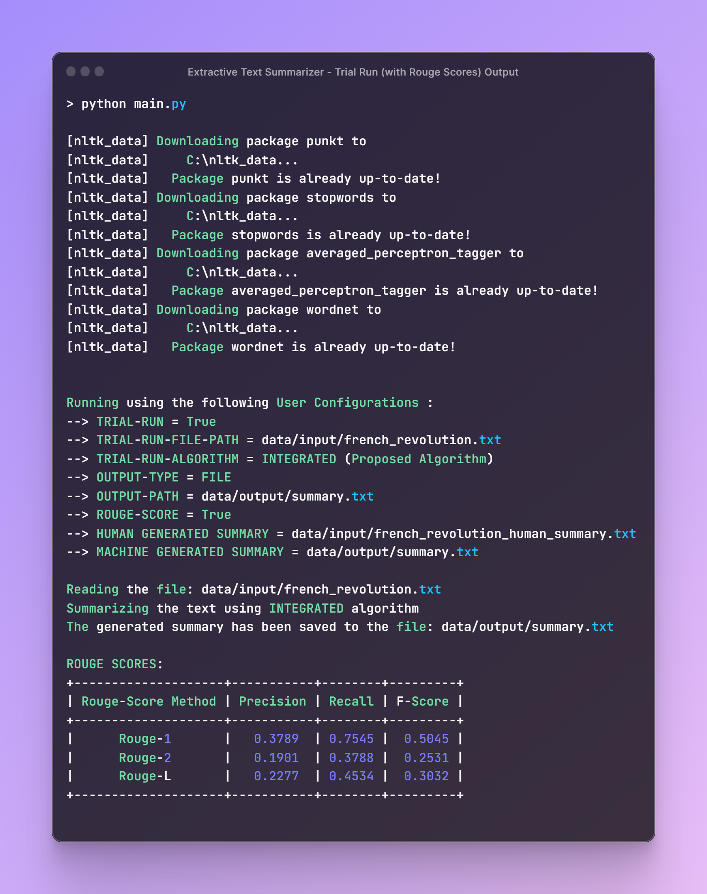

<br />
<div align="center">
  <a href="https://github.com/gulvaibhav20/extractive-text-summarizer">
    
  </a>
  <div align="center">
    <h3> Extractive Article Summarizer</h3>
    <h5> [Using Integrated Text Rank and BM25+ Algorithm] </h5>
  </div>
</div>

<!-- TABLE OF CONTENTS -->
<details>
  <summary>Table of Contents</summary>
  <ol>
    <li>
      <a href="#about-the-project">About The Project</a>
      <ul>
        <li><a href="#built-with">Built With</a></li>
      </ul>
    </li>
    <li>
      <a href="#getting-started">Getting Started</a>
      <ul>
        <li><a href="#prerequisites">Prerequisites</a></li>
      </ul>
    </li>
    <li><a href="#flow-of-the-process">Flow of the Process</a></li>
    <li><a href="#contact">Contact</a></li>
    <li><a href="#license">LICENSE</a></li>
  </ol>
</details>

## About The Project


<center><strong> Project Screenshot </strong></center> <br />

<div style="text-align: justify">
Textual data is growing exponentially over the internet, it is very tough task to obtain important and relevant information from it. One needs efficient and effective method that provides a concise summary of an article. This can be achieved by the usage of automatic text summarization. <br /> <br />

Use the `MAIN.ipynb` to get started.
</div>
<p align="right">(<a href="#top">back to top</a>)</p>

### Built With
This section lists the major frameworks/libraries used in the project :

* [Python](https://www.python.org/)
* [NLTK - Natural Language Toolkit](https://www.nltk.org/)
* [Networkx - Network Analysis in Python](https://networkx.org/)
* [Numpy - Numerical Python](https://numpy.org/)
* [Pandas - Python Data Analysis Library](https://pandas.pydata.org/)

<p align="right">(<a href="#top">back to top</a>)</p>

## Getting Started

Just ***clone*** this repository to get started. Follow the steps to get a local copy up and running :

### Prerequisites

* Jupyter Notebook
* Install Python Packages
  ```
  pip install -r requirements.txt
  ```

## Flow of the Process

<p align="center">
  
</p>
<center><strong> Project Methodology </strong></center> <br />

<div style="text-align: justify">

- Retrieval of textual data from the article source.
- Data preprocessing via Stopword Removal, Tokenization, POS Tagging, and Lemmatization.
- Calculation of similarity between each sentence pair  
- Graph Formation considering each sentence as a node and similarity as edge weight.
- Ranking each sentence via modified TextRank algorithm.
- Selecting top 20% sentences to generate summary.
</div>

<p align="right">(<a href="#top">back to top</a>)</p>

## Contact

Vaibhav Gulati - gulvaibhav20@gmail.com

Project Link: [https://github.com/gulvaibhav20/extractive-text-summarizer](https://github.com/gulvaibhav20/extractive-text-summarizer)

<p align="right">(<a href="#top">back to top</a>)</p>

## License

Distributed under the [MIT](https://choosealicense.com/licenses/mit/) License. See `LICENSE.txt` for more information.

<p align="right">(<a href="#top">back to top</a>)</p>
